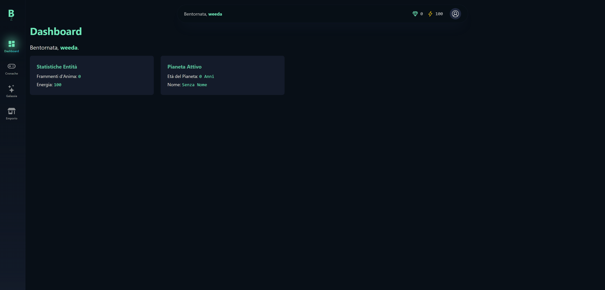

# Bioma zero

#### **I. La Visione del Gioco**
Bioma Zero è un'avventura narrativa interattiva incentrata sulla **creazione e personalizzazione**. Il giocatore, un'entità chiamata **Erede**, non combatte, ma interpreta **echi del passato** (le Cronache) per guadagnare energia creativa e dare vita a un bioma unico e personale. Il ciclo di gioco fondamentale è: **Interpretazione → Ricompensa → Creazione**.

#### **II. Il Kernel: Il "Narrative Engine"**
Il cuore del gioco è un motore narrativo flessibile, progettato per essere riutilizzato per diversi tipi di contenuti (Cronache, Paradossi, etc.).

*   **Contenuti Dinamici (Supabase Storage)**: Tutte le narrazioni (file JSON, immagini, suoni) risiedono nel bucket `chronicles` (e futuri `paradoxes`), rendendo il gioco aggiornabile senza nuovi deploy.
*   **Struttura Narrativa**:
    *   **Manifest (`manifest.json`)**: La "carta d'identità" di ogni narrazione, con metadati e la definizione degli atti.
    *   **Atti (`atto1.json`, etc.)**: Contengono la storia, suddivisa in **Nodi** (tappe). Ogni atto può avere uno sfondo visivo unico.
    *   **Nodi**: Definiscono ogni scena con testo, immagini, suoni, scelte, condizioni logiche (`"has_variable"`, `"has_state"`) e azioni (`"set_variable"`, `apply_state`).
*   **Salvataggio Robusto (Profilo Utente)**:
    *   **`active_narratives`**: Un campo `jsonb` che salva lo stato in tempo reale delle avventure in corso (atto, nodo, variabili, debuff), garantendo la possibilità di riprendere in qualsiasi momento.
    *   **`narrative_records`**: Un `jsonb` per i record personali (miglior tempo, punteggio, etc.), aggiornato solo a fine partita per massima efficienza.

#### **III. Meccaniche di Gioco e Ricompense**

*   **Risorse Principali**:
    *   **`Soul Fragments`**: Valuta per acquistare oggetti collezionabili nell'Emporio.
    *   **`Energy`**: Risorsa per iniziare le Cronache.
*   **Ricompense delle Cronache**:
    *   **Garantite (a fine cronaca)**: `Soul Fragments` e `Anni Bioma` (che fanno salire di livello il bioma).
    *   **Rare (durante la cronaca)**: Possibilità di trovare oggetti collezionabili (es. Avatar) in nodi specifici. Questi oggetti sono **tematici** e provengono dalla cartella `assets/` della cronaca stessa.
*   **Meta-Gioco e Prestigio**:
    *   **Set di Collezionabili**: Ogni cronaca ha un set di oggetti rari da trovare.
    *   **Titoli/Rank**: Completare un set di collezionabili sblocca un **Titolo** estetico per il giocatore (es. "Geomante della Genesi"), visibile sul suo profilo.
    *   **Hall of Fame (Leaderboard)**: Per ogni cronaca, una classifica basata sul **minor numero di passi** per raggiungere il finale migliore, incentivando la rigiocabilità e la strategia.

#### **IV. L'Architettura Tecnica**

*   **Stack**: SolidStart (Frontend), Supabase (Backend, Database, Storage, Auth).
*   **Logica Separata**:
    *   **Backend API (`/api/game/narratives/`)**: Un set di endpoint RESTful sicuri che agiscono da "arbitro", gestendo la logica di gioco, i salvataggi e le ricompense.
    *   **Frontend**: Un'interfaccia reattiva e immersiva che si occupa solo della presentazione, comunicando con le API per ogni azione di gioco.

---

### **La Roadmap: Dalla Teoria alla Realtà**

Suddividiamo questo grande lavoro in fasi gestibili e logiche.

#### **Fase 1: Le Fondamenta dell'API e della Selezione**

*   **Obiettivo**: Permettere al giocatore di *vedere* le cronache disponibili.
*   **Task**:
    1.  **Backend**: Creare l'endpoint API `GET /api/game/chronicles` che legge i `manifest.json` da Supabase Storage.
    2.  **Frontend**: Creare la pagina `/game/chronicles` che chiama l'API e visualizza le "card" delle cronache, mostrando titolo, copertina, descrizione e stato ("Inizia/Continua/Completata").
    3.  **Contenuti**: Creare la cartella `/genesi/` su Supabase Storage e caricare un `manifest.json` e una `cover.webp` per la nostra prima cronaca.

#### **Fase 2: Il Cuore del Motore e il Player**

*   **Obiettivo**: Permettere al giocatore di *giocare* una cronaca dall'inizio alla fine.
*   **Task**:
    1.  **Backend**: Sviluppare gli endpoint `GET /api/game/chronicles/[id]` (per iniziare/riprendere) e `POST /api/game/chronicles/[id]/progress` (per avanzare). Implementare la logica di lettura dei nodi, le transizioni semplici e il salvataggio su `active_narratives`.
    2.  **Frontend**: Creare la pagina dinamica `/game/chronicles/[id].tsx` e il componente `ChroniclePlayer.tsx`. Questa UI mostrerà lo sfondo dell'atto, l'immagine del nodo, il testo animato e i pulsanti di scelta.
    3.  **Contenuti**: Creare i file `prologo.json` e `atto1.json` per "Genesi", con una struttura semplice di nodi narrativi e di scelta.

#### **Fase 3: Arricchire l'Esperienza**

*   **Obiettivo**: Aggiungere le meccaniche avanzate che rendono il gioco profondo.
*   **Task**:
    1.  **Backend**: Potenziare l'API per interpretare le `conditions` (variabili), le `actions` (`set_variable`, `apply_state`) e i `drops` di oggetti.
    2.  **Frontend**: Aggiornare il `ChroniclePlayer` per mostrare gli effetti dei debuff e le notifiche "Toast" quando si trova un oggetto.
    3.  **Contenuti**: Modificare i JSON di "Genesi" per includere puzzle basati su variabili e il drop di almeno un avatar.

#### **Fase 4: La Meta-Struttura e la Competizione**

*   **Obiettivo**: Implementare le ricompense a lungo termine e la competizione.
*   **Task**:
    1.  **Backend**: Implementare la logica di fine cronaca nell'API, che calcola le ricompense, aggiorna il profilo e i `narrative_records` (con il numero di passi).
    2.  **Frontend**: Creare la pagina `/game/hall-of-fame` (o simile) che mostra le leaderboard.
    3.  **Frontend**: Aggiornare la pagina del Profilo Utente per mostrare i Titoli sbloccati.