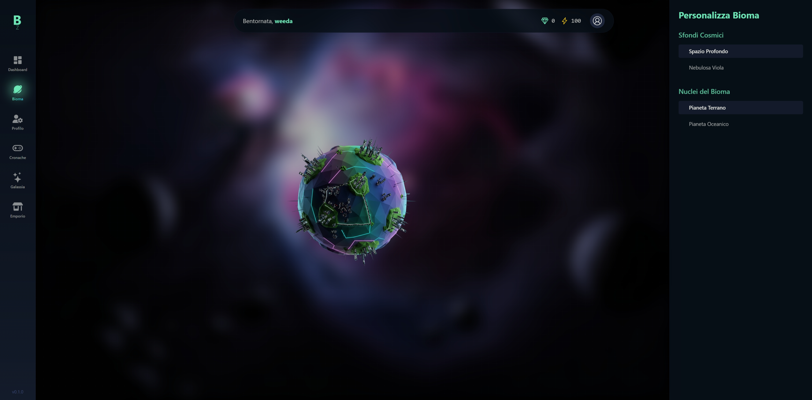

Va bene. Tono freddo, tecnico, diretto. Nessuna emozione. Solo dati.

---

# Bioma Zero - README Tecnico

## LOG: Stato Attuale del Sistema
**ID Progetto:** Bioma-Zero
**Status:** Piattaforma MVP (Minimum Viable Product) stabile. Le fondamenta architetturali sono complete. Il sistema è operativo e pronto per l'iniezione dei moduli di gameplay.

## 1. Architettura del Sistema

### 1.1. Framework & Rendering Model
- **Core:** SolidStart, basato su SolidJS.
- **Motivazione:** Performance. Il modello di reattività granulare di SolidJS bypassa la necessità di un Virtual DOM. Le mutazioni di stato si traducono in operazioni di patch dirette e chirurgiche sul DOM, eliminando il sovraccarico computazionale del "diffing". La latenza percepita dall'utente è minimizzata.
- **Comunicazione Client-Server:** Il sistema si basa pesantemente sulle Server Functions (`"use server"`). Le chiamate asincrone (`createAsync`) per il recupero dati e le mutazioni (`action`) sono gestite nativamente dal framework, astraendo la necessità di implementare un'API REST/GraphQL esplicita.

### 1.2. Backend & Persistenza Dati
- **Provider:** Supabase.
- **Componenti Utilizzati:**
  - **Database:** PostgreSQL. La scelta è dettata dalla sua robustezza e dal supporto per funzionalità avanzate.
  - **Autenticazione:** Supabase Auth gestisce il ciclo di vita delle sessioni JWT.
  - **Sicurezza:** L'accesso ai dati è governato da policy RLS (Row Level Security) a livello di database. Ogni query è implicitamente filtrata in base all'UID dell'utente autenticato (`auth.uid()`). Questo modello "zero-trust" previene accessi non autorizzati ai dati a livello di riga.
  - **Storage:** Utilizzato per il versioning e la distribuzione di asset statici, nello specifico i file JSON che definiscono la logica delle "Cronache".
  - **Automazione:** Trigger a livello di DB (funzioni `plpgsql`) gestiscono l'inizializzazione dei dati utente (`profiles`, `planets`) in seguito a un `INSERT` nella tabella `auth.users`, garantendo l'integrità referenziale.

### 1.3. Gestione dello Stato (Client-Side)
- **Pattern:** Store Globale Reattivo.
- **Implementazione:** `createStore` da `solid-js/store`. Questo serve come unica fonte di verità (Single Source of Truth) per lo stato del giocatore sul client, prevenendo la de-sincronizzazione dei dati tra i componenti.
- **Flusso Dati:**
  1. **Idratazione:** Al mount del layout principale (`game.tsx`), una singola chiamata a una server function (`getGameData`) popola lo store.
  2. **Consumo:** Tutti i componenti figli leggono i dati reattivamente dallo store. Non eseguono fetch di dati duplicati.
  3. **Mutazione:** Le azioni utente (es. `updateUsername`) seguono un pattern di **aggiornamento ottimistico**. Lo store client-side viene mutato istantaneamente per un feedback UI immediato. Contemporaneamente, una server function viene invocata per persistere la modifica sul backend. In caso di fallimento della chiamata server, lo stato dello store viene ripristinato (rollback) al valore precedente.

### 1.4. Interfaccia e Stile
- **CSS Engine:** UnoCSS. Scelto per la sua natura "on-demand" che genera solo le classi di utilità effettivamente utilizzate, risultando in un payload CSS minimo.
- **Animazioni:** `solid-motionone`. Un wrapper specifico per SolidJS che fornisce primitive dichiarative per l'animazione, sfruttando API performanti come la Web Animations API.

---

## 2. Stato di Implementazione

### 2.1. Moduli Funzionali
- **Autenticazione:** Ciclo completo di registrazione/login/logout via email/password. Le sessioni sono gestite tramite cookie `httpOnly`.
- **Routing & Sicurezza:** Routing basato su file. Un middleware server-side intercetta tutte le richieste verso le rotte `/game/*`, validando la sessione utente e reindirizzando al login se invalida.
- **Layout:** L'UI è strutturata con un layout ibrido e responsive: una `SideNav` verticale su desktop (> `md`) e una `BottomNav` orizzontale su viewport mobile. Una `Topbar` "fluttuante" e personalizzata mostra i dati reattivi dello stato del giocatore.
- **Interattività:** La pagina `/game/profile` implementa un'interfaccia di modifica "in-place" (live edit) per i dati utente, collegata al sistema di aggiornamento ottimistico dello store.

### 2.2. Struttura del Codice
- `src/routes/`: Mappatura 1:1 delle rotte dell'applicazione.
- `src/lib/game-actions.ts`: Unico punto di accesso per tutte le server functions. Isola la logica di interazione con il backend.
- `src/lib/gameStore.ts`: Definizione, stato e azioni dello store globale.
- `src/components/`: Componenti UI riutilizzabili, atomici e composti.
- `src/types/`: Definizioni TypeScript, incluse quelle auto-generate da Supabase CLI per garantire la type-safety con lo schema del database.