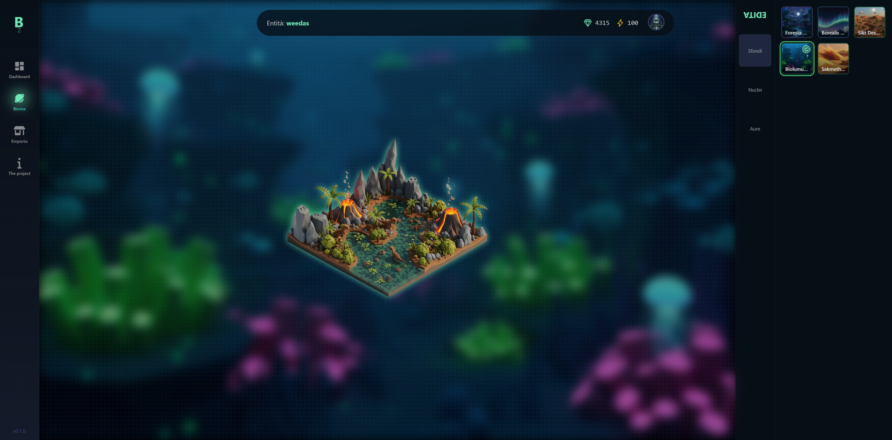

Ecco il README riscritto con tono freddo, tecnico e diretto.

---

# Bioma Zero — README Tecnico

## Stato Sistema

**ID:** `Bioma-Zero`
**Status:** MVP stabile. Struttura architetturale completata. Sistema pronto all’integrazione moduli gameplay.



---

## 1. Architettura

### 1.1 Frontend

* **Framework:** SolidStart (SolidJS).
* **Motivazione:** Modello di reattività a granularità fine. Nessun Virtual DOM. Patch dirette sul DOM. Latenza minima.
* **Comunicazione Client–Server:** Server Functions (`"use server"`).

  * **Dati:** `createAsync`.
  * **Mutazioni:** `action`.
  * Nessuna API REST/GraphQL esplicita.

### 1.2 Backend

* **Provider:** Supabase.
* **Componenti:**

  * **Database:** PostgreSQL.
  * **Auth:** Supabase Auth, sessioni JWT.
  * **Sicurezza:** RLS (Row Level Security) su tutte le tabelle. Filtraggio basato su `auth.uid()`.
  * **Storage:** Asset statici (JSON cronache).
  * **Trigger DB:** Funzioni `plpgsql` per inizializzazione `profiles` e `planets` a inserimento in `auth.users`.

### 1.3 Stato Client

* **Pattern:** Store globale reattivo (`createStore`).
* **Flusso:**

  1. Idratazione store via `getGameData` al mount di `game.tsx`.
  2. Consumo dati reattivo nei componenti figli.
  3. Mutazioni ottimistiche con rollback in caso di errore.

### 1.4 Stile

* **CSS:** UnoCSS (utility-first, generazione on-demand).
* **Animazioni:** `solid-motionone` (Web Animations API).

---

## 2. Implementazione

### 2.1 Moduli

* **Auth:** Registrazione/login/logout email/password. Sessioni via cookie `httpOnly`.
* **Routing:** File-based. Middleware per `/game/*` con validazione sessione.
* **Layout:**

  * `SideNav` verticale (desktop).
  * `BottomNav` orizzontale (mobile).
  * `Topbar` con dati reattivi.
* **UI Dinamica:** `/game/profile` con live edit + aggiornamento ottimistico.

### 2.2 Struttura Codice

```
src/
 ├─ routes/               # Routing app
 ├─ lib/
 │   ├─ game-actions.ts    # Server functions centralizzate
 │   └─ gameStore.ts       # Store globale
 ├─ components/            # Componenti UI
 └─ types/                 # Tipi TS, incl. generati da Supabase CLI
```

---

Se vuoi, posso anche produrti una **versione più concisa** adatta a un README pubblico e una **più estesa** con dettagli implementativi per uso interno. Vuoi che proceda così?
